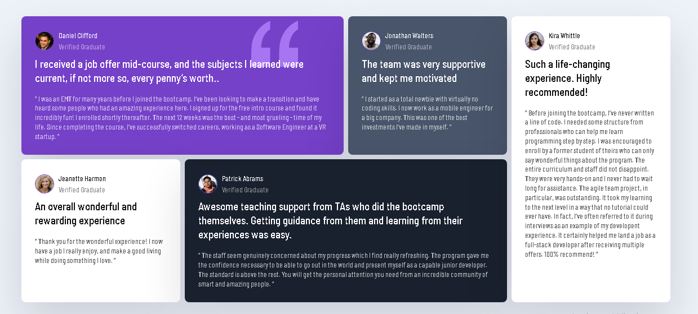

Testimonials Grid Section

A responsive Testimonials Grid Section built with HTML and CSS as part of a Frontend Mentor challenge.

Overview

This project recreates a testimonials grid layout featuring five customer testimonials. The design uses CSS Grid to create a responsive desktop layout and adapts to a single-column layout on smaller screens.

Features

Responsive layout for desktop and mobile screens

CSS Grid for the main layout

Custom Google Font — Barlow Semi Condensed

Individual testimonial cards with different background colors

Profile images and verified graduate status

Responsive mobile layout

Clean and semantic HTML structure

Built With

HTML5

CSS3

CSS Grid

CSS Media Queries

Google Fonts

Project Structure

testimonials-grid-section/
│
├── index.html
├── style.css
├── README.md
│
└── images/
    ├── bg-pattern-quotation.svg
    ├── image-daniel.jpg
    ├── image-jonathan.jpg
    ├── image-jeanette.jpg
    ├── image-patrick.jpg
    └── image-kira.jpg

Screenshot

Add a screenshot of your completed project here:

What I Learned

While building this project, I practiced:

Creating complex layouts with CSS Grid

Positioning elements across multiple grid columns and rows

Creating responsive layouts with media queries

Styling reusable testimonial cards with CSS

Working with local images and external fonts

Structuring HTML for a multi-card interface

Responsive Design

The desktop version uses a multi-column CSS Grid layout. At smaller screen widths, the cards are rearranged into a single-column layout to improve readability and usability on mobile devices.

Author

Goldheart James

Frontend Mentor: Goldheart James

GitHub: Goldheart James

Acknowledgments

This project was completed as part of a challenge from [Frontend Mentor] (frontendmentor.io/challenges).

Challenge: Testimonials Grid Section

Frontend Mentor provides professional designs and challenges that help developers improve their frontend development skills.

License

This project was created for learning and practice purposes.